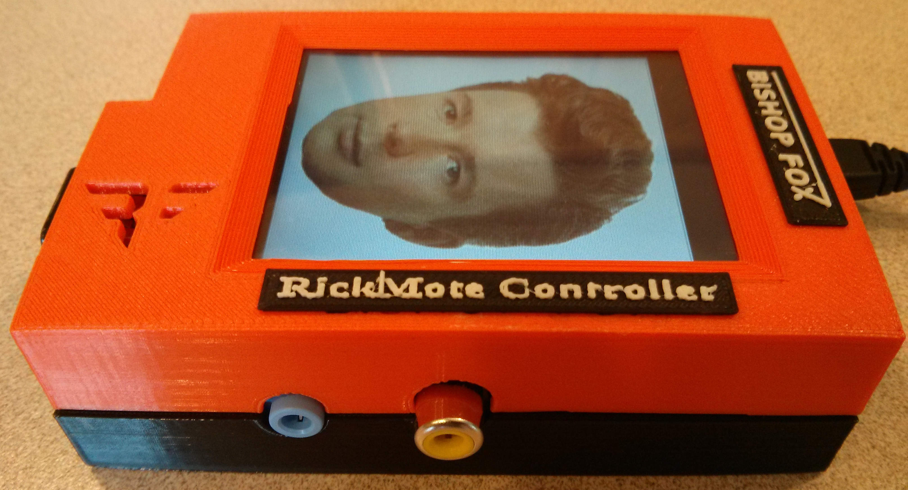

rickmote
========

## The Rickmote Controller: Hijack TVs using Google Chromecast

The Rickmote is a Python program for Hijacking Chromecasts and playing arbitrary video to their connected TVs. Full details on how the hack works were provided at the talk "Rickrolling your Neighbors with Google Chromecast" at HOPE X in New York. Check it out here:

https://www.youtube.com/watch?v=Bv9rlT8Zgvw

Additionally, this is all streamlined into a Raspberry Pi (pictured above). If you want to try pranking your friends, here are the vital ingredients:

##### Software Dependencies:
* aircrack-ng
* Tkinter python library (python-tk in debian)
* hostapd
* dnsmasq
* Network Manager, specifically nmcli

##### 3D Printed Case:
Download the 3D models for the slick Rickmote 3D printed case here at Thingiverse
http://www.thingiverse.com/thing:398100

##### Setup Assumptions:
The Rickmote Controller needs to pull a lot of Wi-Fi shenanigans in order to automate the hack. For best results, you may want to try using Kali Linux as it has the easiest setup for wireless drivers that support injection. Also note that we are actively working on reducing these assumptions! Sorry it's so specific in the meantime.
* Three wireless interfaces.
    * wlan0 is a client interface that is set to Managed mode
    * mon0 is a monitor mode interface that supports packet injection
    * wlan2 is a an AP that is set to Master mode
* wlan2 is an access point to an open AP named "RickmoteController", using hostapd
* wlan2 has an IP of 192.168.75.1, netmask 255.255.255.0
* A working Internet connection, bridged to wlan2
    * Tethering to a smart phone tends to be a decent method
    * We currently only have support for playing YouTube videos from the real Internet
* It is also worth noting that the current Rickmote de-authenticates every wireless network it sees, and is generally very rude
    * We're working on making the Rickmote less intrusive to other innocent bystander Wi-Fi networks
    * In the meantime, be nice to the networks around you... unless you're pranking their TV of course

#### More Information
For more information, [try here](https://www.youtube.com/watch?v=dQw4w9WgXcQ).
